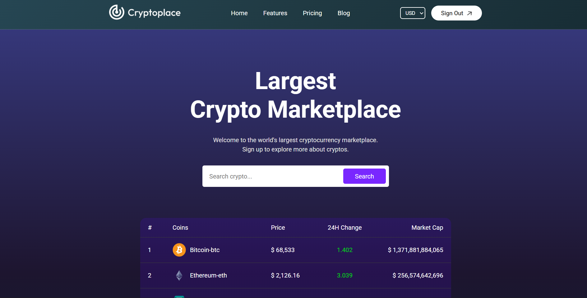

# 🚀 CryptoPlace

CryptoPlace is a modern cryptocurrency marketplace web app built with React and Vite. It allows users to explore real-time crypto prices, view detailed coin analytics, and securely sign up or log in with Firebase authentication.



## ✨ Features

- 🔒 **Authentication:** Secure sign up, sign in, and sign out with Firebase.
- 📈 **Live Crypto Data:** Real-time prices, market cap, and 24H changes for top cryptocurrencies.
- 🔍 **Search & Filter:** Instantly search for any coin by name.
- 📊 **Charts:** Interactive price history charts powered by Google Charts.
- 🌐 **Currency Switch:** View prices in USD, EUR, or INR.
- 🦄 **Responsive UI:** Beautiful, mobile-friendly design with animated backgrounds.
- 🦾 **Toast Notifications:** User feedback for actions and errors.

## 🛠️ Tech Stack

- **Frontend:** React 19, Vite, React Router, CSS Modules
- **Charts:** react-google-charts
- **Authentication & Database:** Firebase, Firestore
- **State Management:** React Context API
- **Notifications:** react-toastify

## 📦 Installation

1. **Clone the repository:**

    ```bash
    git clone https://github.com/your-username/cryptoplace.git
    cd cryptoplace
    ```

2. **Install dependencies:**

    ```bash
    npm install
    ```

3. **Set up environment variables:**
    - Create a `.env` file in the root directory.
    - Add your Firebase and CoinGecko API keys:
        ```
        VITE_FIREBASE_API_KEY=your_firebase_api_key
        VITE_COINGECKO_API_KEY=your_coingecko_api_key
        ```

4. **Start the development server:**

    ```bash
    npm run dev
    ```

5. **Open in browser:**
    - Visit [http://localhost:5173](http://localhost:5173)

## 📂 Project Structure

```
CryptoPlace/
├── public/
├── src/
│   ├── assets/           # Images and icons
│   ├── components/       # Navbar, Footer, LineChart
│   ├── context/          # CoinContext (global state)
│   ├── pages/            # Home, Coin, Login
│   ├── firebase.js       # Firebase config & auth helpers
│   ├── App.jsx           # Main app component
│   └── main.jsx          # Entry point
├── package.json
├── vite.config.js
└── README.md
```

## 🔧 Available Scripts

- `npm run dev` - Start development server
- `npm run build` - Build for production
- `npm run preview` - Preview production build
- `npm run lint` - Run ESLint

## 🎯 Key Components

### Authentication

- Secure Firebase authentication with email/password
- User session management with Firebase Auth hooks
- Protected routes for authenticated users only

### Real-time Data

- Live cryptocurrency data from CoinGecko API
- Real-time price updates and market statistics
- Historical price charts for detailed analysis

### User Interface

- Modern, responsive design with CSS animations
- Intuitive navigation and search functionality
- Toast notifications for user feedback

## 🔌 API Integration

### CoinGecko API

This project integrates with the **CoinGecko API** to provide comprehensive cryptocurrency data:

#### Endpoints Used:

- **`/coins/markets`** - Fetches live market data for cryptocurrencies
- **`/coins/{id}`** - Gets detailed information for specific coins
- **`/coins/{id}/market_chart`** - Retrieves historical price data for charts

#### Features Powered by CoinGecko:

- 📊 **Real-time Prices** - Live cryptocurrency prices with automatic updates
- 📈 **Market Statistics** - Market cap, trading volume, and price changes
- 🕒 **Historical Data** - 10-day price history for interactive charts
- 🌍 **Multi-Currency** - Support for USD, EUR, and INR pricing
- 🔍 **Comprehensive Data** - Market rank, supply data, and price statistics

#### API Configuration:

```javascript
// Example API call from CoinContext.jsx
const options = {
    method: "GET",
    headers: {
        accept: "application/json",
        "x-cg-demo-api-key": import.meta.env.VITE_COINGECKO_API_KEY,
    },
};

fetch(
    `https://api.coingecko.com/api/v3/coins/markets?vs_currency=${currency.name}`,
    options,
);
```

#### Proxy Setup:

The app uses Vite proxy configuration to handle API requests and avoid CORS issues:

```javascript
// vite.config.js
server: {
  proxy: {
    '/api': {
      target: 'https://api.coingecko.com/api/v3',
      changeOrigin: true,
      rewrite: (path) => path.replace(/^\/api/, '')
    }
  }
}
```

## 🌟 Usage

1. **Sign Up/Login:** Create an account or log in with existing credentials
2. **Browse Coins:** View the top cryptocurrencies with live prices
3. **Search:** Use the search bar to find specific cryptocurrencies
4. **View Details:** Click on any coin to see detailed information and charts
5. **Switch Currency:** Change between USD, EUR, and INR pricing

## 🤝 Contributing

Pull requests are welcome! For major changes, please open an issue first to discuss what you would like to change.

1. Fork the repository
2. Create your feature branch (`git checkout -b feature/AmazingFeature`)
3. Commit your changes (`git commit -m 'Add some AmazingFeature'`)
4. Push to the branch (`git push origin feature/AmazingFeature`)
5. Open a Pull Request

## 📄 License

This project is licensed under the MIT License - see the [LICENSE](LICENSE) file for details.

## 🙏 Acknowledgments

- [CoinGecko API](https://www.coingecko.com/en/api) for cryptocurrency data
- [Firebase](https://firebase.google.com/) for authentication and database
- [React Google Charts](https://react-google-charts.com/) for chart visualization

---

> Made with ❤️ by Abhishek Kumar
